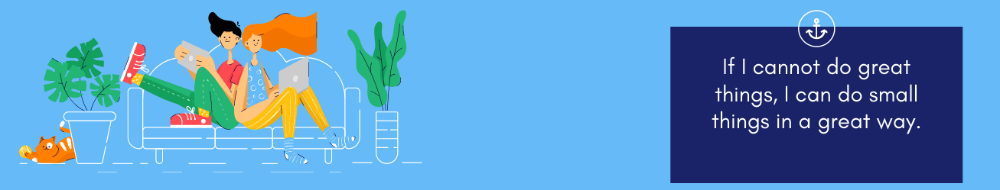

### Peek-a-boo! 👋
A full stack web developer with a variety of coding niches, from databases to UI/UX management. I have a passion for learning and sharing my knowledge with others in a way that's as public as possible. You can see a full list of what I am working on 🔭[code assassin](https://codeassassin.herokuapp.com/ ). If you found value in something I have created, please feel free to send a tip, follow, reach out 📫 or give me a shout out @codeassassin

### Github Stats

### Look

  Think how a lot of companies are trying to migrate and/or build their services on the cloud, to be accessed by their users with just a session in their web browsers from their homes or even using their cellphones. That involves a lot of work from a variety of areas, from Interface Design, Database Design, Back-End Development, Front-End Development, Mobile Development and more. You have so many choices to keep learning, expand your skill set and make some good earnings while building things that will be in line for innovation. Now, that’s interesting!

